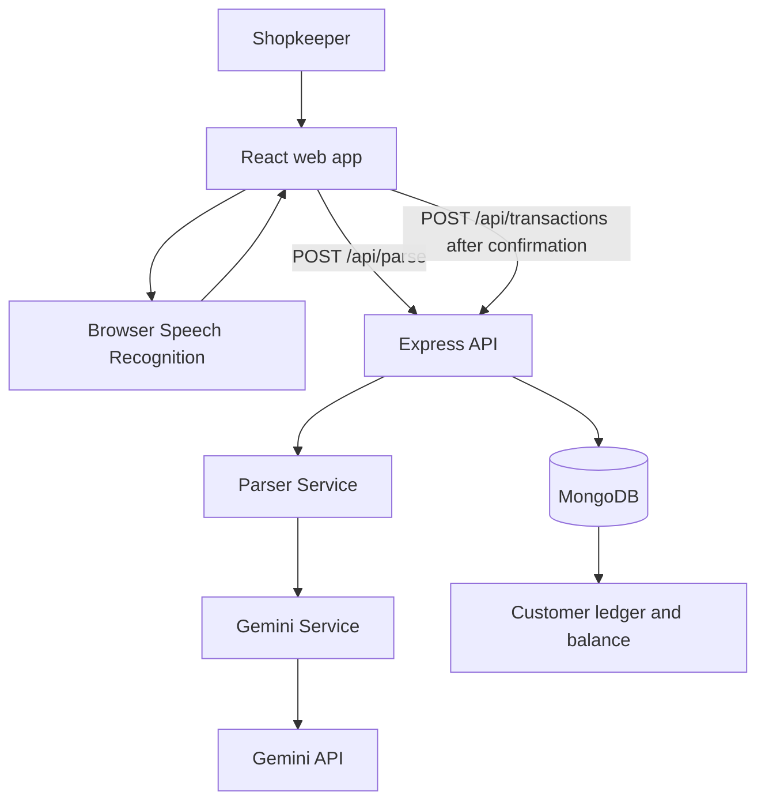

# Pesum Kanakku (பேசும் கணக்கு)

A minimal Tamil voice-first credit ledger. A small shopkeeper speaks (or types) a transaction instead of writing it in a notebook.

> **Status: MVP.** It proves one workflow:
> Tamil/Tanglish voice → structured transaction → human confirmation → save to ledger → view customer balance.

## 1. Problem

Many small shops in Tamil Nadu give goods to regular customers on credit and record it in a paper notebook (*kanakku pusthakam*). During busy hours entries are slow to write, handwriting is hard to read, totals are added up by hand (and sometimes wrongly), and a lost notebook means lost money. Typical accounting apps are too complicated for this user.

## 2. MVP solution

1. **Speak or type** a sentence, e.g. *"முருகன் கிட்ட ரெண்டு கிலோ அரிசி 120 ரூபாய்க்கு கடனா கொடுத்தேன்"*.
2. The backend asks **Gemini** to turn the sentence into fields: intent, customer, item, quantity, unit, amount. Customer and item names are kept **exactly as spoken** (முருகன், அரிசி, துவரம் பருப்பு); they are not translated.
3. The app shows a **confirmation screen**. The person can edit any field. **Nothing is saved until they press "Confirm & Save".**
4. The entry is saved in MongoDB. The customer's **outstanding balance is calculated in application code** (`total credit − total payments`). The AI never calculates balances.

## 3. Features (only what exists)

- Choose a customer from a list, add a customer, or let the sentence name the customer
- Speak (browser speech recognition, `ta-IN`) or type a sentence
- Gemini parsing through the backend (API key never reaches the browser)
- Confirmation screen, full edit screen with validation, explicit save
- Credit and payment entries
- Customer list with outstanding balance; customer page with transaction history
- Friendly error messages (no stack traces shown to users)
- Seed script with fictional demo customers
- Parser tests, balance tests, and a 25-sentence sample file

Not included on purpose: login, GST, inventory, payments gateway, reminders, charts, WhatsApp, offline mode.

## 4. Architecture



The frontend only talks to Express. Express calls `parserService`, which calls `geminiService`. To change the AI later (for example a rules parser first, Gemini as fallback), change `parserService.js`; nothing else needs to move.

```
pesum-kanakku/
├── client/                React + Vite (JavaScript)
│   └── src/ components/ pages/ services/ hooks/ utils/
├── server/                Node + Express + Mongoose
│   ├── seed.js            fictional demo data
│   ├── scripts/           optional real-Gemini check (eval:ai)
│   └── src/ config/ controllers/ routes/ models/ services/ utils/ middleware/ tests/
├── .env.example
└── README.md
```

## 5. Setup

Requirements: Node.js 18+, MongoDB running locally (or a MongoDB Atlas connection string), a Gemini API key.

```bash
npm run setup          # installs root, server and client dependencies
cp .env.example .env   # then edit .env (see section 6)
npm run seed           # optional: fictional demo data (only if the database is empty)
npm run dev            # starts backend (5000) and frontend (3000)
```

Open **http://localhost:3000** in Chrome.

Run separately if you prefer: `npm run start:server` and `npm run start:client`.
`npm run seed:reset` deletes all customers and transactions first, then seeds.

If MongoDB is not running, the server still starts, prints a clear message, keeps retrying, and the app shows "database not available" instead of crashing.

## 6. Environment variables

One `.env` file in the project root. Never commit it.

| Variable | Meaning |
|---|---|
| `PORT` | Backend port (default `5000`) |
| `MONGODB_URI` | MongoDB connection string (default `mongodb://127.0.0.1:27017/pesum_kanakku`) |
| `GEMINI_API_KEY` | Gemini key, used only by the backend |
| `GEMINI_MODEL` | Gemini model name, not hard-coded (example in `.env.example`; use any model your key can access) |
| `GEMINI_TIMEOUT_MS` | Optional. How long to wait for Gemini (default 30000). The app retries once automatically |
| `GEMINI_THINKING_BUDGET` | Optional. `0` turns off "thinking" on Flash models for faster replies. Leave empty if unsure |

## 7. Demo script

1. Click **+ New Entry**. Leave the customer on "Select customer" (or pick one).
2. Tap **Speak** and say, or type: *முருகன் கிட்ட ரெண்டு கிலோ அரிசி 120 ரூபாய்க்கு கடனா கொடுத்தேன்.*
3. The confirmation screen shows Customer முருகன், Item அரிசி, Quantity 2 kg, Amount ₹120, Type Credit.
4. Press **Confirm & Save**. You see "✓ Entry saved".
5. Press **View Customer**. Murugan's outstanding balance and history are updated.

With seed data Murugan starts at ₹840 outstanding, so after this entry he shows ₹960.

## 8. API

| Method | Path | Purpose |
|---|---|---|
| POST | `/api/parse` | `{ text, knownCustomers? }` → structured fields |
| POST | `/api/customers` | `{ name }` → creates a customer (or returns the existing one) |
| GET | `/api/customers` | All customers with `outstanding` |
| GET | `/api/customers/:id` | One customer, balance, history (newest first) |
| POST | `/api/transactions` | Validates and saves a confirmed entry; returns the updated balance |
| GET | `/api/transactions` | Latest entries (`?customerId=` and `?limit=` optional) |
| GET | `/api/health` | Server, database and AI-config status |

`POST /api/parse` returns `success: true` when customer, intent and amount were all found. Otherwise it returns `success: false` with `missingFields` (for example `["amount"]`) and the partial `data` so the person can complete it by hand. Missing values are `null`; nothing is invented.

## 9. Improving Tamil accuracy

There is no model training in this MVP. Accuracy comes from four things you can improve:

1. **The prompt** (`server/src/utils/promptTemplate.js`): it lists Tamil credit words (கடன், பாக்கி, நிலுவை), payment words (கட்டினார், கொடுத்துட்டாரு), number words, units and common items such as துவரம் பருப்பு and உளுந்து, plus worked examples. When Gemini gets a real sentence wrong, add that sentence to `EXAMPLES` and any missing word to the vocabulary.
2. **Saved customers**: the app sends your customer names to Gemini, and the server also forgives one-letter speech slips (முருகண் → முருகன்) when only one saved customer is that close.
3. **Your own test sentences**: add real sentences, with the answer you expect, to `server/src/tests/testSentences.json`, then run `npm run eval:ai` to see which ones Gemini gets wrong.
4. **Real corrections**: every saved entry stores the original sentence (`originalText`) next to the final, human-confirmed values. Entries where the person had to edit the fields are the best new test sentences.

Units are stored as standard codes (kg, g, L, packet); names and items stay in the spoken language.

## 10. Tests

```bash
npm test          # parser, validation and balance tests (no internet, no API key)
npm run eval:ai   # optional: runs the 25 sample sentences through the real Gemini model
```

**What the tests prove, and what they do not.** `npm test` uses pretend AI answers to check our own code: cleaning values, dropping extra fields, finding missing fields, validation, and balance maths. It does **not** show that Gemini understands real Tamil speech correctly. `npm run eval:ai` prints how many sample sentences Gemini got right, but 25 sentences is a small sanity check, not a measure of real-world accuracy. Test with real shopkeepers and real voices before trusting it.

## 11. Limitations

- Speech recognition depends on browser support (works best in Chrome) and needs internet; Tamil accuracy needs more testing, especially with shop noise and accents.
- Internet is required for Gemini parsing. Typing and manual entry still work if parsing fails, but saving needs the backend and MongoDB.
- No offline support. Offline voice, offline AI and sync are not built.
- AI can misread names, items or amounts. That is why every entry must be confirmed by a person.
- No authentication: anyone who can open the app can see and add entries.
- No production security audit, backups, rate limiting or deployment configuration.
- Transactions cannot be edited or deleted after saving.
- This is an MVP.

## 12. Troubleshooting

- **"Server unavailable"**: the backend is not running, or `PORT` in `.env` is wrong.
- **"The database is not available"**: start MongoDB, check `MONGODB_URI`.
- **"Something went wrong on the server" when saving**: look at the server terminal for the line starting `Unexpected server error`. On an older database the server repairs customer records and indexes when it starts, so restart it once. If it still fails, run `npm run seed:reset` (this deletes all customers and entries).
- **"The AI took too long"**: Gemini was slow. Tap Continue again, or raise `GEMINI_TIMEOUT_MS`.
- **"The AI parser is not set up"**: set `GEMINI_API_KEY` and `GEMINI_MODEL` in `.env`, restart the server.
- **Microphone does nothing**: use Chrome, allow microphone access, or use **Type**.
